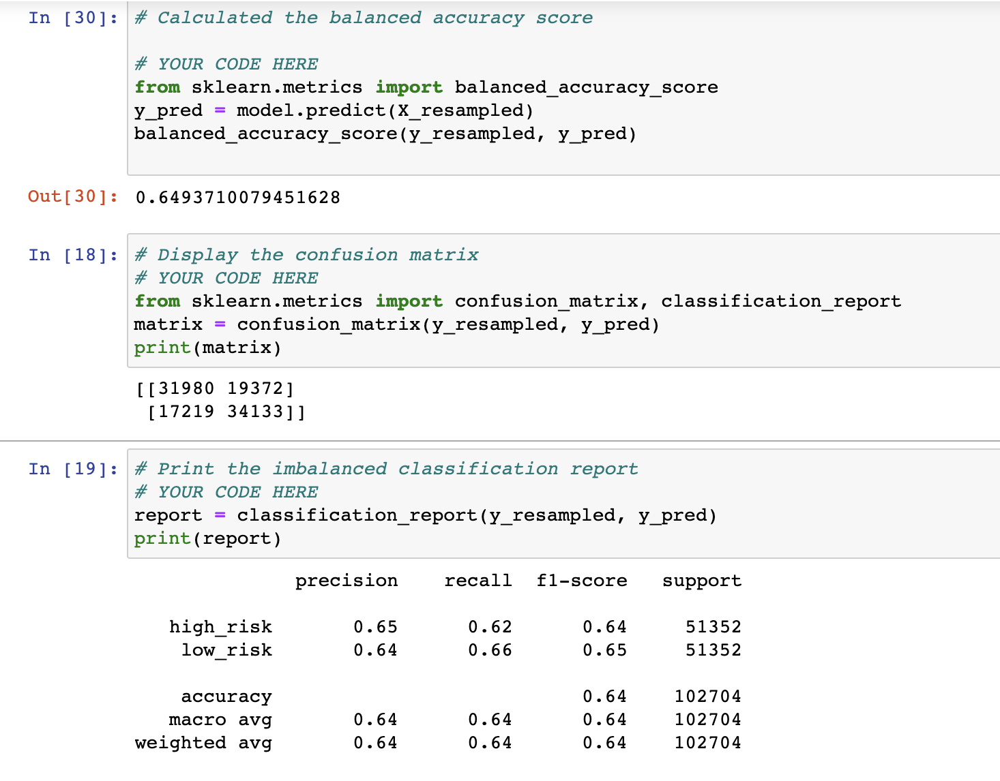
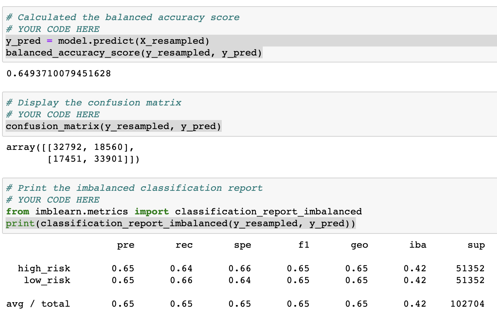
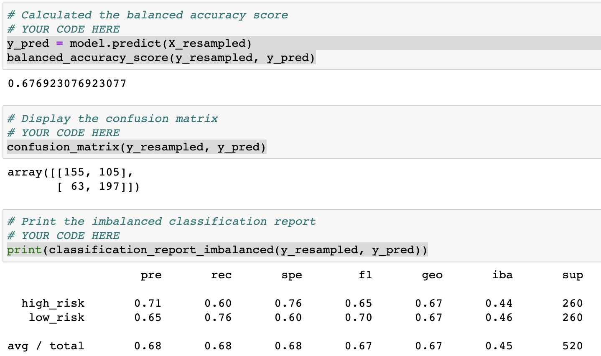
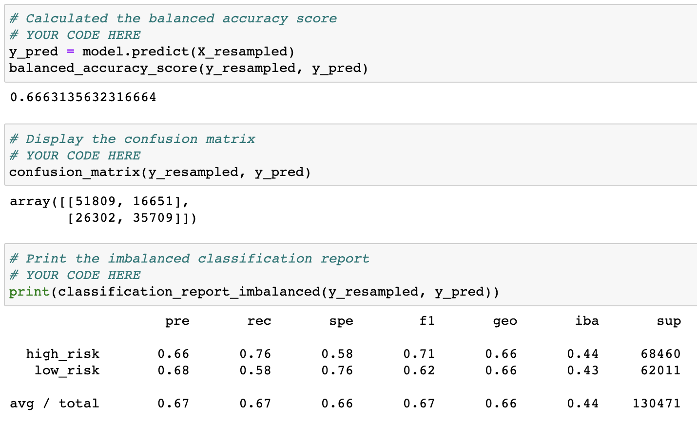
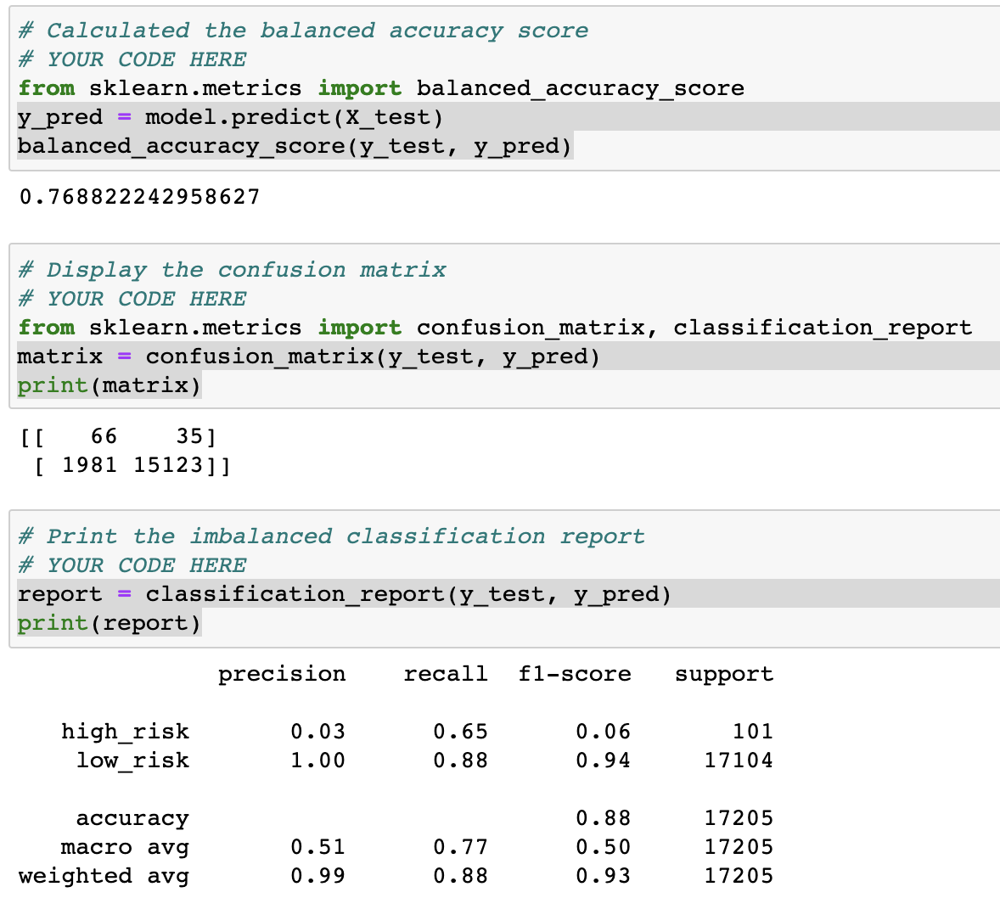
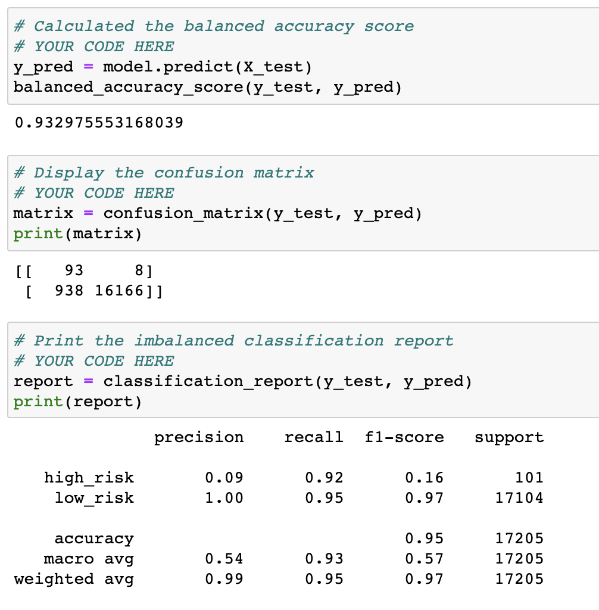

# Credit_risk_analysis

## Overview

The purpose of this analysis is to find the best possible algorithm to predict whether giving out a loan is a high-risk or low-risk operation based on a series of metrics for individual users. This is an inherently imbalanced problem, given that low-risk credits considerably outnumber the opposite category, so employing sampling techniques will be necessary.

Using Supervised Machine Learning techniques, several models are trained by first declaring which variables are parameters and which are features, then splitting both sets into training and testing variables. After the training stage, the testing part of the data is used to evaluate the model, after which an accuracy score, a confusion matrix and an imbalanced classification report are generated to validate how effective each algorith is.

## Results

 Four sampling techniques were used with the Logistic regression algorithm:

| Type      | Name | Metrics |
| ----------- | ----------- | ----------- |
| Oversampling      | Naive Random Oversampling       |           |
| Oversampling   | SMOTE        |    |
| Undersampling      | Cluster Centroids       |      |
| Combination  | SMOTEEN        |        |

Two other algorithms were used:

- Balanced Random Forest
 

- Easy Ensamble Classifier
 

## Summary

Based on the balanced accuracy score, the Clustered Centroids sampling technique yields the best results although it is not particularly impressive. Even so we can conlude that it is the best performing technique so far, and we can now build on this knowledge by trying to further clean the data or increase the sample size.

As for the other two algorithms we can see that their balanced scores are fairly impressive, however once we look at the confussion matrix we can see that their precission on high-risk credits is very poor, meaning that we are unlikely to correctly detect them.

Based on the results prevoiusly discussed I would recomend using the Clustered Centroids sampling method and the Logistic Regression algorithm, altough it is far from perfect, we can already see the beginning of a robust and reliable method for predictions.
